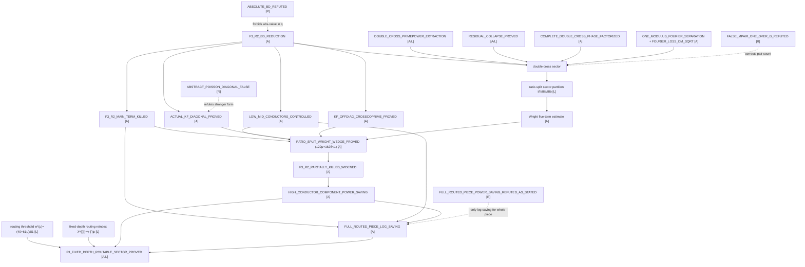
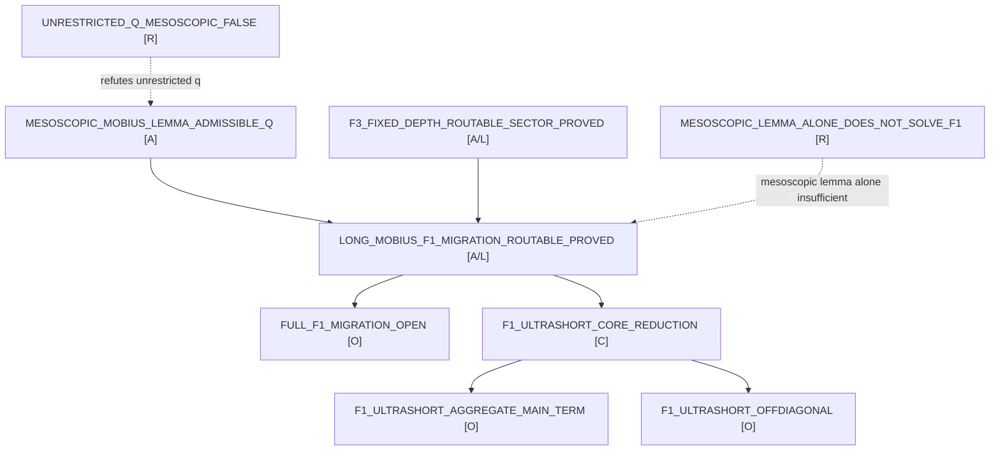
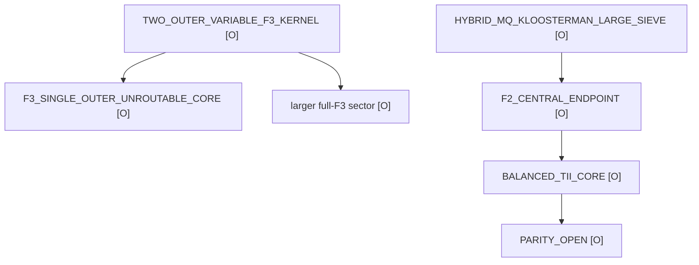

# Dependency graph — Shifted Möbius Type-II / F3

Status legend: **[A]** externally audited, **[L]** Lean-proved (or Lean algebraic
core), **[C]** conditional interface / bridge, **[O]** open input, **[R]** refuted.







## Plain-text DAG (as requested in §15.B)

```text
BD reduction
  -> main term + low conductors
  -> pre-Poisson diagonal
  -> cross-coprime sector
  -> double-cross algebra/Fourier
  -> ratio-split Wright sectors
  -> 122/162 KF wedge
  -> widened r=2 F3 partial kill (high-conductor component, power saving)

fixed-depth routing (this update)
  -> routing threshold w > w*(μ) = (40+61μ)/81            [L]
  -> routing reindex λ^{(j)} = γ·∏_{i≠j} ψ_i              [L]
  -> high-conductor component power saving                [A]
  -> + main term + low/mid conductors + conductor window
  -> FULL routed piece: LOG saving only (not power saving) [A]
  -> routable long-Möbius F1 migration                    [A/L]

exact next wall
  -> TWO_OUTER_VARIABLE_F3_KERNEL                          [OPEN]
      -> balanced/unroutable fixed-depth F3, unroutable F1, larger full F3
```

## Ford/F1/F2 conservative update

```text
F1_GLOBAL_CENTERING_IDENTITY [LEAN_PROVED_CORE]
  -> F1_COMPARISON_SEQUENCE_AXIOMS [OPEN_INPUT]
  -> F1 aggregate off-diagonal [OPEN_INPUT]

F2_DOUBLE_MELLIN_PRIME_UNIT [SOURCE_PENDING]
  -> F2_PP_MAIN / F2_PN_SINGLE_SPECTRAL / F2_NP_SINGLE_SPECTRAL [SOURCE_PENDING]
  -> F2_NN_RECIPROCAL_TENSOR [OPEN_INPUT]
       -> RECIPROCAL_CHARACTER_TENSOR_LARGE_SIEVE [OPEN_INPUT]
  -> F2_COMPOSITE_GCD_REASSEMBLY [OPEN_INPUT]
  -> FULL_F2 [OPEN_INPUT]

FULL_F1 + FULL_F2 + FULL_F3
  -> UNIFORM_PROJECT_TYPE_II [OPEN_INPUT]
  -> Ford transference [CONDITIONAL_INTERFACE]
  -> FORD_MAYNARD_POSITIVITY_INTERFACE [SOURCE_PENDING]
```
