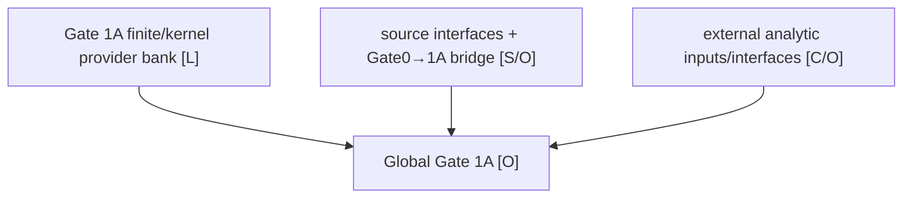
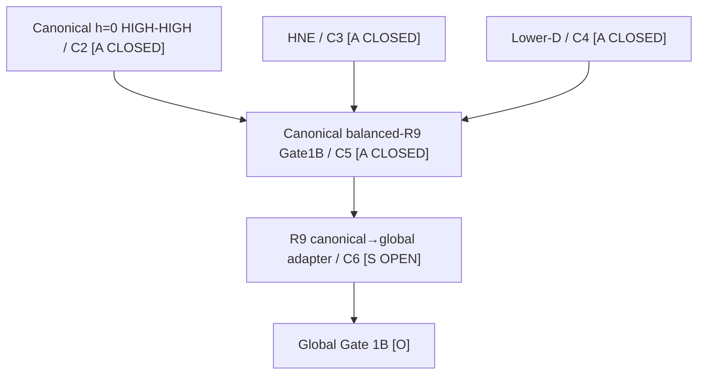
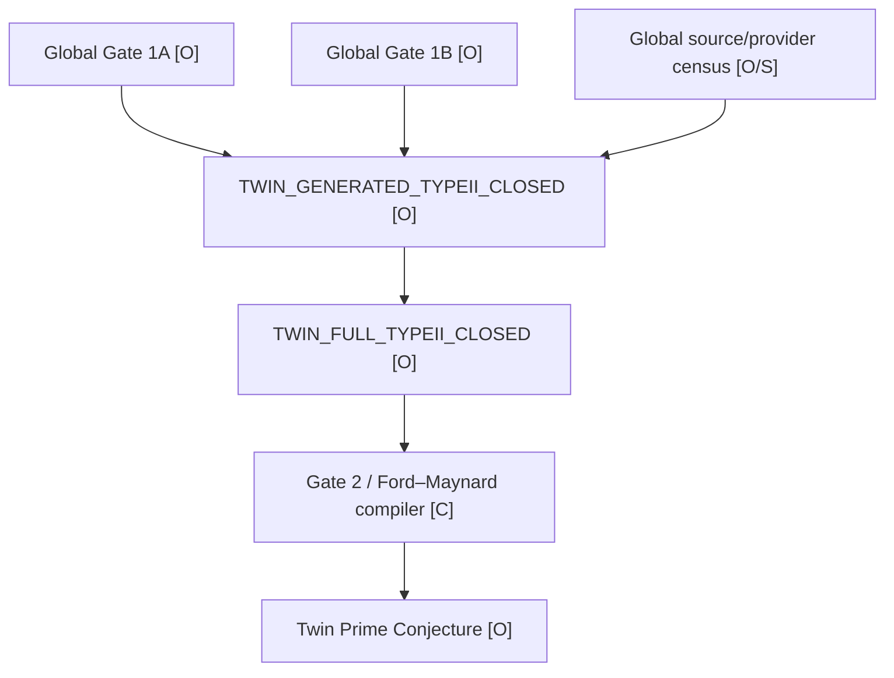

# Gate 1A / Gate 1B Dependency Graph — 31 August 2026

This file is a current high-level dependency overlay. Older dependency graphs remain historical records of earlier frontiers.

## Status legend

- **[L]** kernel-proved finite/algebraic theorem
- **[A]** audited analytic/source-compiler result outside Lean
- **[C]** conditional interface/compiler
- **[S]** source/global bridge open
- **[O]** open

## Gate 1A



Controlling public status:

`GATE1A: OPEN`.

The finite/kernel bank is substantial, but this graph does not promote source/interface hypotheses into results.

## Gate 1B — fresh canonical balanced-`R_9`



The final HNE repair is the source-level two-copy AP Fourier projection:

`HNE-APINDEX-2D-APFOURIER-PROJECTION45: PASS`.

There is no remaining internal analytic residual in the frozen canonical balanced-`R_9` branch.

The global bridge is:

```text
Delta_R9^adapter
  = b_9^can - P_R9 b^FM
```

with target `||Delta_R9^adapter||_G <= 1` plus exact zero-mode comparison.

## Global downstream firewall



No arrow in this graph is supplied merely by using the same phrase “Type II”. Each export requires a literal source/range/coefficient dictionary.

## Comparison architecture


The packet-local `b_9^can` must not be promoted to the global Ford–Maynard `b`: its global prime-mass contract fails. The adapter is the explicit bridge between the two roles.

## Historical formulation

The historical switched `E_hist` remains a source/specification pin for the legacy statement, but is bypassed by the explicit canonical packet theorem. It must not be silently identified with `b_9^can` or the canonical switched aggregate.
